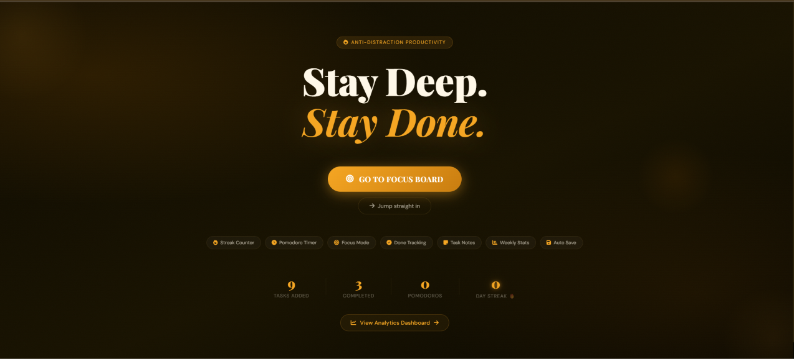

<div align="center">

# 🎯 FocusBoard

### Stay Deep. Stay Done.


**An anti-distraction productivity app** — Kanban board, Pomodoro timer & Focus mode, all in one place.

[🔗 Live Demo](https://focus-board-dusky.vercel.app)



</div>

---

## ✨ Features

- **Kanban Board** — Drag-and-drop tasks across To Do, In Progress, Review, and Done columns
- **Pomodoro Timer** — Built-in 25/5 focus-break cycle with a live progress ring and round tracker
- **Focus Mode** — Distraction-free, full-screen view for a single task with its own timer and a motivational quote
- **Streak Tracking** — Daily streak counter that rewards consistency, with a fire animation when you're on a roll
- **Task Notes** — Attach quick notes, links, or ideas to any task
- **Weekly Stats** — Visual breakdown of completed tasks by day of the week
- **Auto Save** — Everything persists locally — no account or setup required
- **Analytics Dashboard** — Optional Firebase-powered admin view for deeper usage insights (see [SETUP_GUIDE.md](SETUP_GUIDE.md))
- **PWA Installable** — Add it to your home screen and use it like a native app, online or offline

## 🖥️ Tech Stack

- **Frontend:** Vanilla HTML, CSS, and JavaScript — no frameworks, no build step
- **Fonts & Icons:** Google Fonts (Playfair Display, DM Sans), Font Awesome
- **Analytics (optional):** Firebase
- **Hosting:** Works on any static host — Vercel, Firebase Hosting, GitHub Pages, etc.

## 📁 Project Structure

```
FocusBoard/
├── index.html         # Main app — landing page, kanban board, focus mode
├── admin.html         # Analytics dashboard
├── admin.js           # Admin dashboard logic
├── client.js          # Client-side analytics/event tracking
├── 404.html           # Custom 404 page
├── firebase.json      # Firebase hosting/project config
├── .firebaserc        # Firebase project alias
├── SETUP_GUIDE.md      # Step-by-step Firebase setup instructions
├── landing.png         # App preview image
└── LICENSE
```

## 🚀 Getting Started

No installation needed for the core app — it's a single HTML file.

1. Clone the repo
   ```bash
   git clone https://github.com/rehanqx/FocusBoard.git
   cd FocusBoard
   ```
2. Open `index.html` in your browser — that's it.

To enable the analytics dashboard (optional), follow the steps in [`SETUP_GUIDE.md`](SETUP_GUIDE.md) to connect your own Firebase project.

## 📱 Install as an App

FocusBoard is a PWA — open it in Chrome, Edge, or Safari and choose **"Add to Home Screen"** (mobile) or **"Install App"** (desktop) to use it offline like a native app.

## 📄 License

This project is licensed under the [MIT License](LICENSE).

---

<div align="center">
Made with 🔥 for people who want to get things done.
</div>
